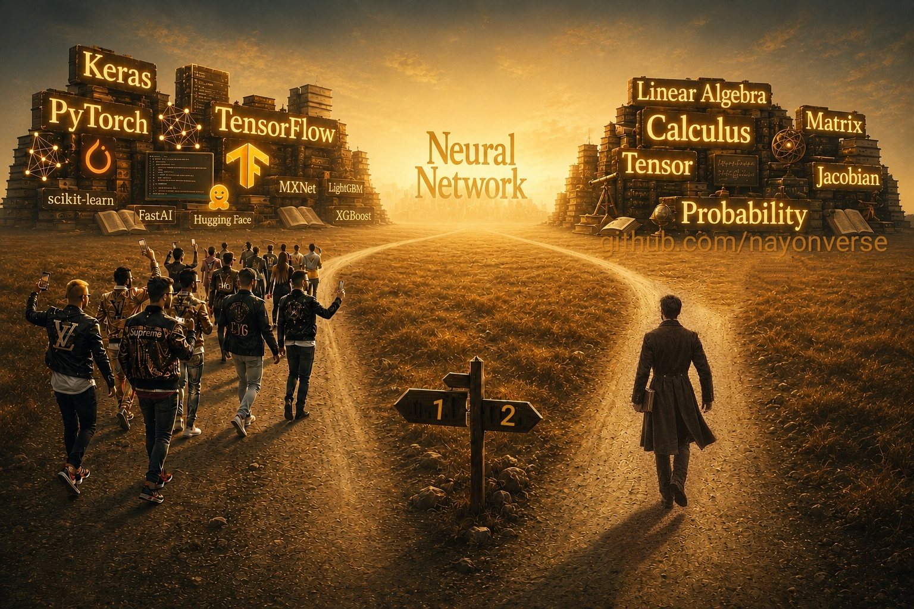

🇧🇩বাংলায় পড়ুন

>### নিউরাল নেটওয়ার্ক কে Python Library হিসেবে না শিখে Mathematics হিসেবে শিখুন।
<h2 align="center">এই রিপোজিটরির উদ্দেশ্য কি?</h2>

**আমরা নিউরাল নেটওয়ার্ক শেখার জন্য ছবিতে দেখানো দ্বিতীয় পথে অগ্রসর হব।**  

- তবে আমরা এখানে **Calculus**, **Tensor**, **vector**,... এগুলো শিখব না।
 
- বরং এইসব mathematical concept ব্যবহার করে হাতে কলমে **NN অ্যালগরিদম** implement করব।
  
- পাইথনের কোনো machine learning লাইব্রেরী ব্যবহার করব না।  
তবে সাধারণ গাণিতিক হিসাব করার জন্য বেসিক পাইথন ব্যবহার করা হতে পারে।

<table>
<tr>
<td>
  
এই রিপজিটরিতে আমরা প্রতিটি টপিকের জন্য একটি ছোট ও নির্দিষ্ট dataset বানিয়ে একটি একটি করে **Neural Network** সমস্যা তৈরি করব।  
এরপর **Calculus**, **linear algebra**, **probability** ইত্যাদির ধারণা ব্যবহার করে সমস্যাটির সমাধান করতে করতে **neural network (NN)** শিখব।  
ঠিক যেন খাতা-কলম-ক্যালকুলেটর নিয়ে ধাপে ধাপে কোনো গণিতের সমস্যা মেলানো।

</td>
</tr>
</table>

এই রিপোজিটরি অধ্যায়ন শেষে আপনি নিউরাল নেটওয়ার্কের গভীরের বিষয়বস্তু সম্পূর্ণ বুঝতে পারবেন এবং নিজে নিজেই স্বাধীনভাবে এলগরিদম সাজিয়ে কোনো সমস্যা সমাধান করতে পারবেন।

- প্রতিটিটি টপিকের ধারাবাহিকতা বজায় রাখুন।  
সূচিপত্র: [0.0-Index/README.md](0.0-Index/README.md)

আমাদের উদ্দেশ্য একটাই:  
How to use it?❌  
How does it work?✅

Read in English

  
>### Don't learn Neural-Network as a library. Learn it as mathematics.
  
<h2 align="center">What’s the aim of this repository?</h2>

**We will proceed through the **second** path shown in the image to learn neural networks.**  

- However, we are not going to study **Calculus**, **Tensor**, **vector**, etc. here.  

- Instead, we’ll use those mathematical ideas directly to get hands-on with implementing **NN algorithms**.  

- We will not use any machine learning library of Python.  
But we might use plain Python for simple arithmetic like addition, subtraction, etc.

<table>
<tr>
<td>
  
In this repository, we will create a Neural Network problem for each topic using a small and specific dataset.  
Then, while solving it using concepts from calculus, linear algebra, and probability, we’ll gradually learn how neural **networks work**.  
It’s much like working through a problem step by step with pen, paper, and a calculator.

</td>
</tr>
</table>

By the end of this repository, you’ll gain a complete grasp of the inner workings of neural networks and be able to independently design algorithms to tackle problems.

- Make sure to follow the sequence of each topic consistently.  
Follow the index: [0.0-Index/README.md](0.0-Index/README.md)

Our aim is one and only:  
How to use it?❌  
How does it work?✅

